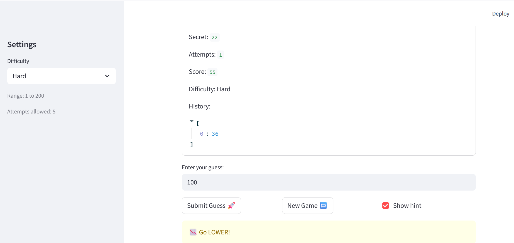

# 🎮 Game Glitch Investigator: The Impossible Guesser

## 🚨 The Situation

You asked an AI to build a simple "Number Guessing Game" using Streamlit.
It wrote the code, ran away, and now the game is unplayable. 

- You can't win.
- The hints lie to you.
- The secret number seems to have commitment issues.

## 🛠️ Setup

1. Install dependencies: `pip install -r requirements.txt`
2. Run the broken app: `python -m streamlit run app.py`

## 🕵️‍♂️ Your Mission

1. **Play the game.** Open the "Developer Debug Info" tab in the app to see the secret number. Try to win.
2. **Find the State Bug.** Why does the secret number change every time you click "Submit"? Ask ChatGPT: *"How do I keep a variable from resetting in Streamlit when I click a button?"*
3. **Fix the Logic.** The hints ("Higher/Lower") are wrong. Fix them.
4. **Refactor & Test.** - Move the logic into `logic_utils.py`.
   - Run `pytest` in your terminal.
   - Keep fixing until all tests pass!

## 📝 Document Your Experience

- [ ] Describe the game's purpose.
The game's purpose is to make guess numbers based upon the difficulty levels of the application. Depending on the difficulty, the user attempts to guess the correct number after x amount of tries. Once the user guesses correctly, the game ends with a surprise shower of balloon gifts. If not correct, then the game simply ends with a ending message. 
- [ ] Detail which bugs you found.
Inverted Hint Messages(logic_utils.py:45-48)
The bug was that the check_guess returned Go HIGHER when the game was too higher and Go LOWER when the game was too low.
Converted to string on Even Attempts(app.py:97-100)
Every even number attempt passed turned into a string instead of an int, making hints unrealiable.
- [ ] Explain what fixes you applied.
Inverted Hint Messages: Swapped the hint messages so each outcome returns the correct direction
Converted to string on Even Attempts:
Removed the conditional string conversion, always passes the int secret
## 📸 Demo

- [ ] [Insert a screenshot of your fixed, winning game here]

## 🚀 Stretch Features

- [ ] [If you choose to complete Challenge 4, insert a screenshot of your Enhanced Game UI here]
